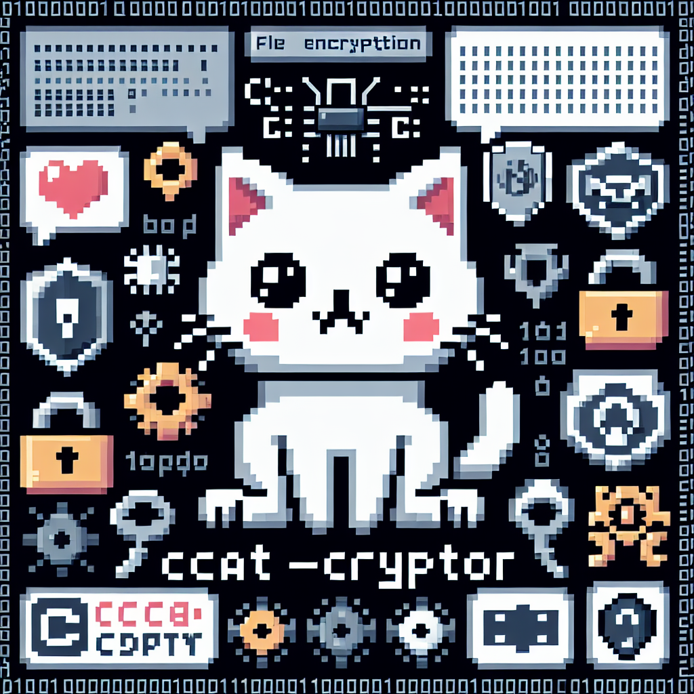

<div align="center">



# CCAT-CRYPTOR

A secure file encryption and decryption tool using AES-256-GCM.

</div>

## Description

This File Encryptor is a command-line tool written in Rust that provides secure encryption and decryption of files within a specified directory. It uses the AES-256-GCM (Galois/Counter Mode) encryption algorithm, which provides both confidentiality and authenticity.

## Features

- Encrypt all files in a directory (including subdirectories)
- Decrypt previously encrypted files
- Uses AES-256-GCM for strong encryption
- Generates random encryption keys and nonces
- Preserves directory structure during encryption/decryption

## Prerequisites

- Rust programming language (latest stable version)
- Cargo package manager

## Installation

1. Clone this repository:

```bash
git clone https://github.com/cats-rs/ccat-cryptor.git
```

2. Build the project:

```bash
cargo build --release
```

The executable will be available in `./target/release/ccat-cryptor`.

## Usage

### Encryption

To encrypt all files in a directory:

```bash
./ccat-cryptor encrypt <directory_path>
```

This will encrypt all files in the specified directory and its subdirectories. The program will output the encryption key and nonce, which you'll need for decryption. Make sure to save these securely!

### Decryption

To decrypt previously encrypted files:

```bash
./ccat-cryptor decrypt <directory_path> <key_hex> <nonce_hex>
```

Replace `<key_hex>` and `<nonce_hex>` with the values provided during encryption.

## Security Notes

- The encryption key and nonce are crucial for decryption. Store them securely and separately from the encrypted files.
- This tool does not implement key management. For production use, consider implementing a secure key management system.
- Encrypted files have a `.ccat` extension appended to their original extension.

## Disclaimer

This tool is provided as-is, without any warranties. Always backup your data before using encryption tools.
